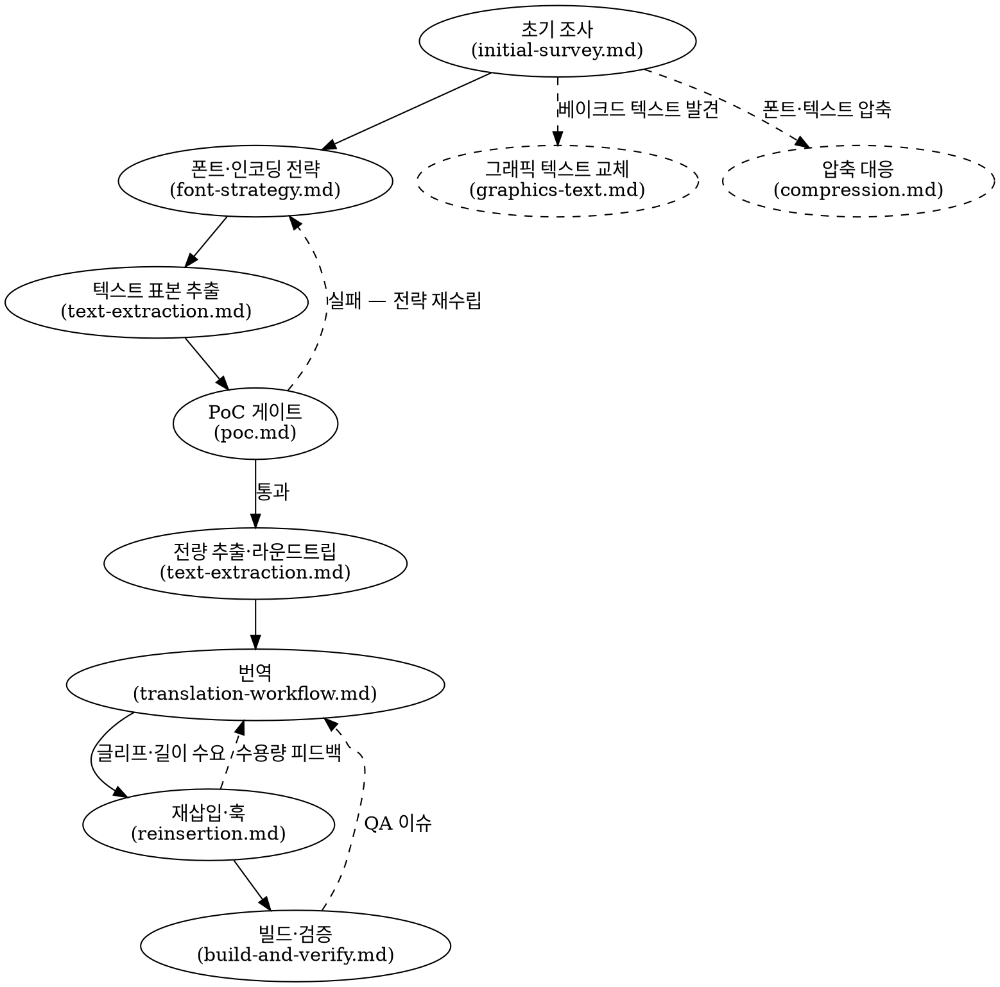

# 레트로 게임 한글 패치 제작

## Overview

레트로 게임의 한글 패치를 처음부터 끝까지 만드는 Agent Skill이다. 대상은 ROM 카트리지·CD/GD-ROM·플로피 디스크 매체의 콘솔·PC 게임 전반이며, 범위는 초기 조사(매체·텍스트·폰트·훅·수용량 파악)부터 폰트·인코딩 설계, PoC, 텍스트 추출, 번역, 재삽입, 빌드·패치 생성, 에뮬레이터 검증까지의 전 파이프라인이다. 크게 단계별 공통 전략(`references/strategy/`)과 플랫폼별 하드웨어 사실·사례 노트(`references/platforms/`)로 나뉜다.

이 SKILL.md는 헌법 티어 문서다. 여기에는 프로젝트가 바뀌어도 유지되어야 하는 원칙, 단계 간 의존, 참조문서 라우팅, 불변식만 둔다. 플랫폼별 수치, 파일 경로, 도구 이름, 특정 게임의 주소·오프셋은 하위 문서나 프로젝트 문서의 책임이다. 이 Agent Skill을 처음 읽는 사람은 선행 작업의 맥락을 모른다고 가정하므로, 각 전략 문서는 과거 사례를 전제로 삼지 말고 질문, 판단 기준, 통과 조건을 독립적으로 설명해야 한다.

**모집단 고지**: 여기 담긴 전략과 사례는 선행 한글화 프로젝트에서 추려낸 것이다. 그 선행 사례는 일본어 원문·텍스트 중심 게임에 치우쳐 있으므로, 본문에서 "자주", "보통", "전형"으로 서술된 패턴도 새 게임에서는 가설이다. 플랫폼 문서의 사례 절은 재사용 가능한 규칙이 아니라 검증된 선례와 위험 신호의 목록이다. 실제 판단 기준과 절차는 반드시 해당 참조문서를 읽고, 대상 게임에서 실측해 확정한다.

## 전체 워크플로우

`project-conventions.md`(저장소 규약)는 특정 단계가 아니라 전 단계를 관통하는 횡단 문서다. 프로젝트 착수 시점에 먼저 적용한다. 그래프의 "빌드·검증 → QA 이슈" 루프에서 버그의 격리·원인 확정은 `references/strategy/debugging.md`를 따른다.

`graphics-text.md`와 `compression.md`는 조건부로 발동하는 횡단 처리다. 초기 조사에서 게임이 텍스트 일부를 폰트 렌더 경로가 아니라 그래픽에 박아 둔 것을 발견하면, 그 부분은 `graphics-text.md`의 교체 파이프라인으로 넘긴다. 폰트나 텍스트 데이터를 압축했다면 식별·해제·재압축은 `compression.md`로 분기한다. 둘 중 무엇이든 발견하는 즉시 별도 트랙으로 처리하되 본 추출·번역 트랙과 병행한다.

그래프의 "텍스트 표본 추출 → PoC" 순서는 인코딩·제어코드 확인에 필요한 만큼의 대표 블록만 다루는 것을 뜻한다. PoC는 한 가지 실험이 아니라 게이트 묶음이다. 최소 가시성 게이트는 대개 한글 1자 화면 출력으로 닫지만, 그 결과가 인코딩 공간·전체 글리프 수용량·재배치 가능성까지 자동으로 증명하지는 않는다. 추가 PoC는 위험 신호가 있을 때만 켜고, 정적 조사와 계산으로 충분히 닫힌 위험은 문서화만 한다. 전량 추출·라운드트립 인프라 완성은 PoC 게이트 이후가 기본이고, 추출 완료 뒤에는 대표 텍스트 1단위(대사 1블록 등)의 엔드투엔드 패치로 파이프라인을 검증한 다음 본 구현에 들어간다.

번역과 재삽입은 단방향 단계가 아니라 피드백 루프다. 번역 또는 초벌 번역이 실제 글리프 수요와 길이 초과를 만들고, 재삽입·폰트 전략은 그 수요를 받아 공간 확장, 슬롯 회수, 동적 적재, 재배치, 길이 보존 여부를 판정한다. 공급 확대 경로가 없다고 판단되거나 시스템적으로 고정된 슬롯은 다시 번역 단계로 돌아가 어휘·문장 길이를 조정한다. 이 루프의 원칙은 "먼저 수용량을 검토하고, 번역 품질을 깎는 것은 마지막 선택지"다.

## 참조문서 라우팅

### 단계 → strategy 문서

| 단계 | 문서 | 내용 |
|------|------|------|
| 초기 조사 | `references/strategy/initial-survey.md` | 매체→파일시스템→코드→폰트→텍스트 엔진 순의 조사 설계, PoC 가능성 판단 6질문 |
| 폰트·인코딩 | `references/strategy/font-strategy.md` | 완성형 vs 조합형, 인코딩 공간 확보, 글리프 예산 산정 공식·서브셋, 폰트 선정·렌더링·크기·비트 깊이 |
| 텍스트 추출 | `references/strategy/text-extraction.md` | 포인터 테이블 발견, 무손실 추출, 라운드트립 검증, 인라인 리터럴 수색 |
| PoC | `references/strategy/poc.md` | 최소 가시성 PoC와 조건부 PoC 게이트의 수행 여부·통과 기준 판정 |
| 재삽입·훅 | `references/strategy/reinsertion.md` | 길이 보존/완전 재배치/제자리 성장 정책, 포인터 재배치, ASM 훅 설계, 공간 확보 |
| 번역 | `references/strategy/translation-workflow.md` | 스토리 재구성(서사 문서·화자 매트릭스), 디렉토리 기반 진척 관리, 용어집 단일 진실 원천, LLM 초벌·교차 리뷰·사람 검수 분업 |
| 빌드·검증 | `references/strategy/build-and-verify.md` | 빌드 파이프라인, 패치 포맷, 체크섬 처리, 에뮬레이터 검증, 텍스트 QA, 이슈 관리 |
| 디버깅·이슈 처리 | `references/strategy/debugging.md` | 디버깅 루프, 격리 기법, 증상 사전, 회귀 운영 |
| 그래픽 텍스트 (횡단) | `references/strategy/graphics-text.md` | 베이크드 텍스트 인벤토리, 클린 배경 복원, 한글 조판, 재인코딩 검증 |
| 압축 대응 (횡단) | `references/strategy/compression.md` | 압축 식별, 디컴프레서 역공학, 라운드트립 기준, 재압축·공간 전략 |
| 저장소 규약 (횡단) | `references/strategy/project-conventions.md` | 저장소 레이아웃, 도구 언어, CLI 설계, 의존성, 테스트, 원본 자산 취급 |
| 실전 팁 (횡단) | `references/strategy/tips.md` | 단계 불문 "이 증상에 이렇게 했더니 풀린" 사례 모음 — debugging.md 방법론의 보조 단서집 |
| 라이브 검증 함정 (횡단) | `references/strategy/live-verification-pitfalls.md` | 폰트 베이스 오진·문자열 경계 누락·화면 실측 없는 "완료" 선언 — 주입 전후 필수 체크리스트 |
| 인라인 토큰·UI 상태 함정 (횡단) | `references/strategy/inline-token-and-ui-state-pitfalls.md` | 패딩 배치 규칙·고정폭 슬롯 반각금지·가변폭 그리드 실측·선택state 별도에셋·멀티에이전트 프로세스 소유권·호스트슬롯 동결(세이브 보호)·초소형 도트폰트 자원 |

### 플랫폼 → platforms 문서

| 플랫폼 | 문서 | CPU / 매체 |
|--------|------|-----------|
| SNES (슈퍼패미컴) | `references/platforms/snes.md` | 65816 / ROM 카트리지 |
| 메가드라이브 | `references/platforms/megadrive.md` | 68000 (빅엔디언) / ROM 카트리지 |
| 세가 새턴 | `references/platforms/saturn.md` | SH-2 ×2 (빅엔디언) / CD-ROM |
| PS1 | `references/platforms/ps1.md` | MIPS R3000A (리틀엔디언) / CD-ROM |
| 드림캐스트 | `references/platforms/dreamcast.md` | SH-4 (리틀엔디언) / GD-ROM |
| PC엔진 / CD-ROM² | `references/platforms/pce.md` | HuC6280 (65C02 슈퍼셋) / HuCard·CD-ROM |
| PC-98 | `references/platforms/pc98.md` | 8086/V30 리얼 모드 / 플로피 디스크 |
| 게임기어 | `references/platforms/gg.md` | Z80A / ROM 카트리지 |
| 닌텐도 DS | `references/platforms/nds.md` | ARM9+ARM7 / ROM 카트리지 (NitroFS) |

목록에 없는 플랫폼이면 strategy 축의 조사 순서·검증 원칙만 출발점으로 삼고, 하드웨어·매체·주소공간·렌더링 경로에 대한 가정은 새로 확정한다. `references/platforms/` 아래에 해당 플랫폼 문서를 새로 작성하되, 골격은 기존 플랫폼 문서들의 목차를 직접 따른다 — 공통적으로 플랫폼 개요 → 메모리 맵·뱅킹 → 비디오·폰트 경로 → 텍스트 엔진 패턴 → 한글 인코딩·운용 → 패치 패턴 → 빌드 → 검증(에뮬레이터·디버거) → 사례 요약의 9~10절이다. 신규 작성 시 개요·메모리·비디오 절은 공개 하드웨어 자료로 먼저 채우고, 게임 분석 절(텍스트 엔진·인코딩·사례)은 조사가 진행되는 대로 추가한다.

## 시작 체크리스트

새 게임에 착수할 때 이 순서를 따른다.

1. **플랫폼 식별** — 게임의 플랫폼과 매체(카트리지/CD/디스크)를 확정한다.
2. **플랫폼 문서 정독** — 해당 `references/platforms/` 문서를 전부 읽는다. 없으면 위 안내대로 새로 작성한다(공개 하드웨어 자료 기반 절부터).
3. **저장소 초기화** — `references/strategy/project-conventions.md`의 레이아웃으로 저장소를 초기화하고, 조사 산출물을 남길 docs 자리를 먼저 마련한다.
4. **초기 조사** — `references/strategy/initial-survey.md`의 순서(매체 → 파일시스템 → 코드 → 폰트 → 텍스트 엔진)대로 조사하고 단계마다 산출물을 docs에 남긴다.

## 핵심 불변식

어느 단계에서든 다음을 위반하지 않는다.

- **0원칙 — 플레이어는 보통 한 번만 플레이한다.** 한글 패치의 배포 기준은 "대체로 동작"이 아니라 알려진 치명 문제 0건이다. 크래시나 진행 불가는 물론이고 글자가 깨지거나, 힌트·아이템명이 틀리거나, 용어·말투가 무너지는 것도 플레이어의 단 한 번뿐인 경험을 망치므로 모두 블로커로 다룬다. 특히 오역은 단순 문장 품질 문제가 아니라 진행 실패, 선택지 오판, 캐릭터 이해 붕괴로 이어질 수 있다.
- **원본 ROM·디스크 이미지·저작 자산은 절대 커밋하지 않는다.** 저장소에는 패치 파일·추출 스크립트·번역 데이터만 둔다. 원본 식별 해시는 문서에 기록한다.
- **라운드트립 검증이 우선이다.** 추출→재조립이 원본과 바이트 단위로 동일함을 먼저 증명한 뒤에야 수정 작업에 들어간다.
- **작업 단위는 후속 선택지를 줄여야 한다.** 조사·PoC·번역 배치·검증은 성공/실패/불명확 어느 결과가 나와도 후속 판단을 더 정확하게 만드는 판정 가능한 형태로 설계한다. 시작 전에 무엇을 구분하려는지, 성공하면 승격할 지식이 무엇인지, 실패하면 버릴 가정이 무엇인지, 애매하면 어떤 더 작은 확인으로 쪼갤지를 의식한다. 결과가 후속 행동을 개선하지 못하면 먼저 질문을 좁힌다.
- **필요한 PoC 게이트를 닫기 전에 본 구현에 착수하지 않는다.** 최소 가시성 PoC와, 위험 신호가 있는 조건부 PoC가 닫히기 전까지 전량 번역, 전체 폰트 생성, 엔진 본 패치 같은 되돌리기 비싼 작업은 시작하지 않는다. 모든 PoC를 의무 수행하지는 않는다. 정적 조사·계산·대표 표본으로 위험이 충분히 닫히면 그 근거를 문서화하고 다음 단계로 간다. 단, 수행하는 PoC는 목표(0원칙)를 가장 크게 위협하는 블로커를 직면하는 방향이어야 하며, "의무 아님"은 증명하기 싼 저위험 위험으로 그 블로커를 대체·우회하는 근거가 되지 않는다.
- **사례 수치를 새 게임에 그대로 가정하지 않는다.** 글리프 슬롯 수, 빈 공간 크기, 포인터 폭 같은 수치는 선행 사례가 아니라 이 게임에서 재실측한 값을 쓴다. 특히 글리프 예산은 고정값이 아니라 병목 자원 산정 공식의 출력이다(`references/strategy/font-strategy.md` 3절).
- **역공학으로 확정하기 전에는 어떤 가정도 이식하지 않는다.** 같은 플랫폼·같은 개발사·같은 시리즈라도 선행 사례의 구조(스크립트 포맷, 포인터 규약, 제어코드)는 가설이지 사실이 아니다.
- **인코딩 누락은 빌드 에러다.** 번역문에 글리프·코드 매핑이 없는 문자가 있으면 조용히 건너뛰지 말고 빌드를 실패시킨다.
